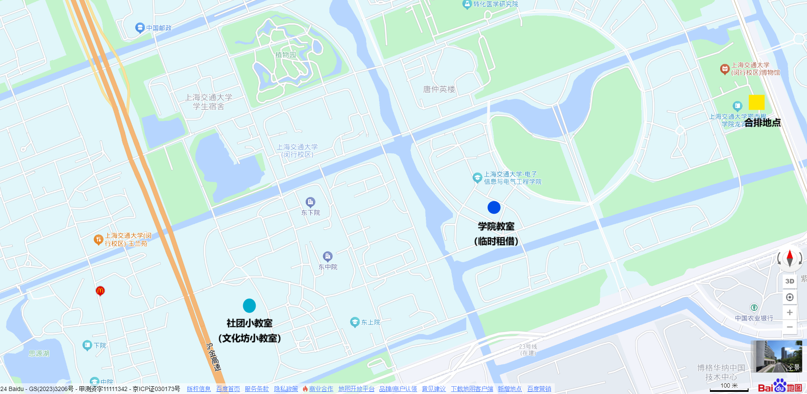

# A.2 冲突的起点

如之前提到过的，本校是有一个官方的民乐团的。由于指导老师不力，加上关系户丛生，校民乐团一直处在一个比较诡异的氛围之中。早先的指导老师认可了G学长的自建乐团的举措，在几位老师的支持下，笛箫协会迅速壮大，成为了能与校团比肩的存在。可是这一年，校团的指导老师换了。这位新老师并没有把校团作为发扬本校民乐水平的组织，只是囿于自己对民乐的肤浅理解，除了小型传统节目以外并不打算涉猎真正能够代表当代学生民乐的优秀曲目。G学长在任期间时常嘲讽隔壁只会翻来覆去地排练《行街》，确实缺乏高校乐团应有的气度。身为本校学生组织对标准专业乐团，G学长的梦想便是进军校团，取而代之。这件事他谋划了很久，从在交响乐团和老师打好关系，到去本校艺教中心担任辅导员，直到借上一任校团指导老师鼓励校团与笛箫协会互通有无的机缘积蓄力量，组建起一支足够抗衡官方的力量。这个寒假，G学长准备正式进军艺教，用实际水平向校方证明我们的实力，挤掉现在的校团和指导老师。

在这之前还发生了一件事。校交响乐团想要排练一首大型组曲，涉及交响乐与民乐，需要二胡领奏。交响乐团的Wb老师自然想到向校民乐团调人，结果他们的水平却是极其摆烂与参差不齐。Wb老师不算满意，但似乎没说什么。G学长只觉得这批人水平实在太差，三把二胡分工还不知道演奏什么，于是在我们的笛箫协会群里拉人，点名了我、E和K，但EK那时自然是互相做局装死不回消息，算到我会去接下这个活，而我的高水平也很快被Wb老师相中，于是自然而然踢掉了校团的乐手，由我一人独揽。后来G和我都想让E作为帮手加入，但E显然拒绝了，自称不大想去。彼时我只道是她不想多事，后来才知道她本身就不是那么喜欢演奏就是了。

只是这件事似乎构成了笛箫和校团的第一个梁子。在名分上，校级官方演出是轮不到我这一个社团成员的，如今却让我抢了这个风头，这也确实得益于Wb老师早就对校团充满看法、信任此时也在交响乐团担任打击乐声部长的G，同时信任笛箫协会以及我。Wb老师在后期笛箫协会维系中提供了鼎力支持，我深切感激却也深感无以为报，这一段先留到后面的章节里，在此按下不表。G学长那时非常得意，由于我的名字缩写刚好和校团现任指导老师的缩写相反，G颇为自得地在我们的群里写道“\*\*成功打脸\*\*”，形成了某种回文式的对称。我一看，这种话传出去不是把我架在火上烤吗？只是我也懒得想那么多，既然是G学长，一定有他的道理。

寒假里，G学长召集我们这几届笛箫协会的核心力量开了个线上短会，大意是准备推进合团事项。G学长称自己已经与学校老师达成一致，可以合团，并且由G所联系的指导老师来带我们排练，承诺不会改变当前符合学生乐团的排练模式与水准。只是，校方要求变更乐团名称，统一至“校民乐团”而弃用“笛箫”的称谓，即便G学长考虑到自己的部下终究是以笛箫协会为名头招进来，可能有一定的感情，故向老师提出对校内称笛箫而对外称校乐团，被老师拒绝，称“这样校团的影响力不够”。G学长说这个事情暂时还没有完全确定，先来问问我们的意见。当时我被G学长指名第一个发言，可能是因为我现在是同时参与了他麾下联络的交响乐团的原因吧。我并没有表达过多的情绪，我只希望这支新的乐团还能够像之前的笛箫协会一样，有着高超的水平和逼近少年宫学生乐团的体验，至于名称并不重要，氛围才是最重要的。随后包括E、N等人轮流说了些表示支持的话，只是很久以后的一次我们这届的社团内部会议，我才知道她们当时都是在无意义地附和，她们心里从来不觉得这件事靠谱。那是我第一次察觉到G学长和同学之间的理念存在矛盾，我内心比较诧异。想来我应该是站在G学长这边多点，至少很长一段时间内我还天真地这么认为。

新学期开学，还没等G学长与校方的洽谈一锤定音，第一次排练就又出现了不愉快的事情。寒假期间，交响乐团有过几次排练，Wb老师希望我能够在部分章节演奏高胡用以表现高音，展现民族特色。彼时G学长说是向校团借琴，因为校团那时和笛箫协会还是有一些联系的，于是那边的同学还是给了。只是我之后一直没有找到机会去还，就寄放在我这里了。结果，第一次排练到一半时，同样时间段进行排练的校团同学想把高胡找出来发现找不到了。于是，当时同时在笛箫协会和校团的一名二胡学长私信我问我有没有见过那把琴。我当时未想太多，答曰在我这里，结果马上招致了“速速送来”的请求——应该说是命令。我答我也在排练，可他却丝毫没有终止的意思，只是催促着让我尽快送去。我没控制好自己的情绪，心想这么久了你们也没来问我们这边要过，偏偏要选在冲突的时间让我来给你们跑腿吗？当时我正奉G学长之命出外办事，一时冲动，想着再去宿舍拿琴送去实在太过折腾，以微信语音的形式语气比较恶劣地骂了几句话。片刻后对面回复仍然执着要求我立刻送去，并且加上了“如果态度这么差以后不借了”之类的话。担心自己闯下了祸，想着这事实在必须要解决，我就多耽搁十几分钟息事宁人吧。约定了接头地点我把琴带去了，那边的同学还在一个劲地解释“当时G学长找校团借琴借错人了，应该找\*\*\*这样不至于变成今天这个样子”。我无心多听，只想快点回到排练地方，不要再耽搁了——期间N还在给我发消息问我怎么现在还没来之类的话，我也不知道如何解释。赶回地方，见大家都在正常排练，我简单和G学长说了下事情的原委。G学长只是淡淡说着“下次碰到这个情况就说如果不借的话让他们去找Wb老师去”，至于我确实被当成了跑腿工具人这一点，并没有被在意也没有被提起。算了吧，事情解决了就行吧，但估计之后校团和我们之间肯定更加存在隔阂了。

不过G学长似乎发现了受制于人这一点，一天带我去了一处笛箫的乐器仓库，说是之前买了几把高胡和中胡，让我挑一挑试一试。在G学长的听音品控把关下，我挑出了2把高胡和1把中胡，并且确定能够加入彼时没有高胡和中胡的乐团弦乐声部里。这两把高胡的其中一把音色柔和，近似小提琴，又有民乐特点；另一把声音粗犷高亢，近似板胡，很适合交响乐团排练的这首曲子。自然地，有了自己的高胡，在硬件层面是可以和校团整体切割了。G学长可能也在谋划最后的合围，孤立校团及其指导老师使其被迫下台。

只是有一件事情是我后来才发现的，那就是G学长对我并没有我以为的那么待见。上一学期的时候G学长就表示想要培养一个指挥的副手与接班人，我和N都表达过意愿，没想到G最后两个都没挑，选了并不是很想担任这个职位的E，让她负责新学期的大团排练任务。E并没有拒绝，但她多次和团里的元老表达过说自己可以学习带排练，但不会上台指挥。当时以团里的积极性而言，我绝对是排得上号的。为此我确实疑惑过一段时间，但想着能做个二胡手为社团出力并没什么不好，也没有多在意。

C社长那边倒是自顾自地开始换届了，准备把我们这一届中坚力量用起来。她安排了几个人选，分别是我担任今后节目组的规划，N负责出摊，另外安排了新宣传组的人员。社团新学期正大光明地招新，也吸纳到了一些强力的新鲜血液。开学不久，第一个新活动，即当年的研究生毕业晚会，找到了我们。我在群里公开招募人员，很快凑到了一支表演阵容，而曲目是我定的，当时沉迷Deemo的我选了日语歌曲的《YUBIKIRI-GENMAN》（其实是日文的勾指起誓）与中文的本家曲一起串联，亲自编曲，凑成了一首颇有氛围的合奏，也似乎符合毕业晚会的氛围。作为自己负责的第一个节目，我自然比较重视，召集额外时间排练了挺多次，达到了一个我比较想要的效果。我的思路也打开了民乐现代化、流行化发展的大门，并且演出也显然取得了成功，这个节目也刷了好几场当年的小节目演出，甚至尝试录制视频投稿，虽然播放量不怎么样就是了。只是我没想到，G学长对我排小节目这件事大为不满，他觉得每周兴师动众地召集同学额外排练纯粹浪费时间，在排练时点名批评我们“研究生的毕业晚会，本科生凑什么热闹？”。同期C社长分发给N的樱花节出摊因为和排练时间冲突，也被G学长一顿阴阳怪气，说是不专心大团排练。我当时就觉得很奇怪，G学长对小节目和学校社团活动意见这么大吗？我们作为一个社团参加学校活动错了吗？这个观点极大冲击了我的认知。我不明白为什么，只是G学长也只是口头叨叨了几句，没有真的出面阻止我们。那就这样吧，似乎也不是什么大事。

这一学期最大的问题是排练安排堪称幽默，虽然源于学校基建的原因。人文学院礼堂翻新，合唱团失去了排练地点，向Wb老师提出请求征用排练厅。本来，我们使用排练厅也是因为Wb老师的支持，现在肯定是要优先让位给合唱团这一校级艺术组织的。我们失去了这个时间段的使用权，那是不是换一个时间段或者地点就可以了呢？答案并不是这样。上一学期，在C社长接管的短暂时间里我们确实用过另一处可以用作排练场所的大厅，但这学期相关老师也是直接翻脸，不借我们不说，还要我们把临时寄放在那儿的设备撤走，过时不候，全部扔掉。既然如此，是不是可以换个时间段呢？G学长的答案是：否。他的考虑是，社团内本市同学居多，且大多有周五下午回家休息的习惯。让他们提前到周日来排练兴许说得过去，但要是周六排练就基本不会来了。G学长找到了当时社团的辅导老师——故事差不多是这样的，每个社团名义上都要有辅导老师，只是因为G学长已经实际上作为社团指导存在了，刚好碰上了一个不多事的老师提供一些行政支持，最后商量出了一个非常抽象的排练方案。按照惯例，每周的排练时间分为两个部分，分声部排练和合并排练。G学长把合排地点联系在了校文博馆的一处地下库房，但那里并没有各声部分开排练的条件，以前的排练厅边上有小房间可以满足。为了弥补这一点，G学长又想出了临时租借学院教室的方法，连上社团另一处由社总统一安排的据点小教室——之后行文还是直接写其原名吧，“文化坊”——可以在分排时间段满足吹管、弦乐、弹拨打击三类声部的分排需要，到了合排的时间再会合到合排场地。听上去是个不错的设计，唯一的缺点是这个教室之间的距离。贴一张图，各位可以根据比例尺感受一下：

事实上，就不论看起来这个距离就不算近，要背着乐器跑来跑去这本身也是一件很折磨人的事情。G学长或许认为，有一个能在周日下午稳定排练的方案就不错了。可是事实果真如此吗？这个我后来称之为颠沛流离的排练方案是不是迫不得已我不好说，但我总认为它确实造成了这学期后期的混乱与接近崩塌。而我也初次感受到了，一个学生组织怎么会突然之间面临种种内忧外患呢？后来我才逐渐知道，其实，我们只是刚好一个缩影罢了。