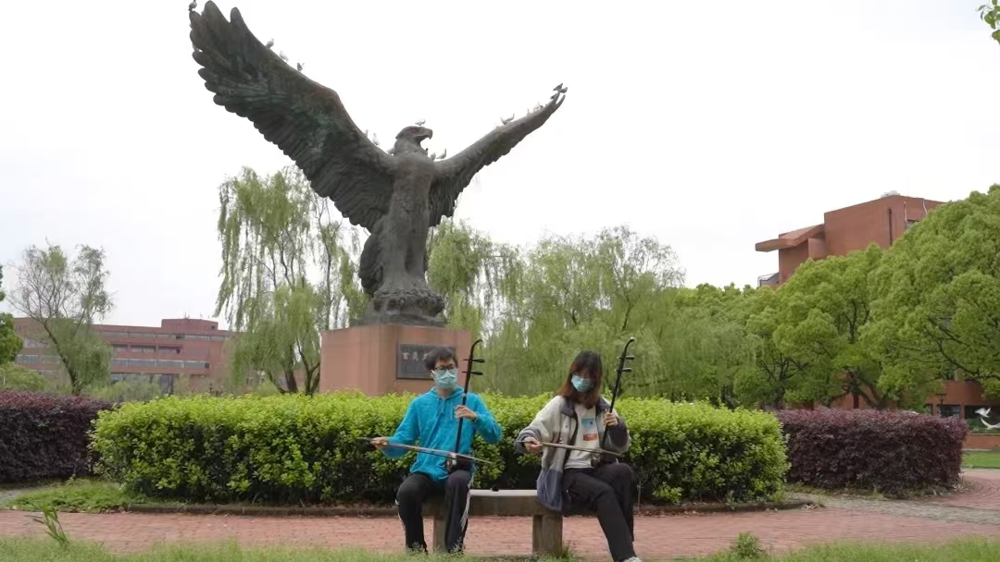

# E.6 嗔、痴、分道扬镳

4月的一天下午，我出门买饭。由于线下聚集仍然处于戒严状态，我们只能从食堂买了饭带回宿舍吃。又一轮跟E闲聊过后，她和我说到正在湖边跟朋友在线上打剧本杀。想来这是某种下午无事的消遣，我想悄悄地去找她。既然在湖边，想必兜上一圈应该就能看到她。我便绕了段路来到湖边，试图寻找她的踪影。她的标志性长发和眼镜，我觉得是很容易找到的。然后，我便看到了永远不想看到的一幕：她和另一个与团内一名学弟高度相似的人一人一个电脑，坐在湖边的长凳上。因为这个场景的确是非常符合她告诉我的题设的：这个学弟确实在她的交往圈子里，也很正常，但在这个时候还能单独约出来坐在一起，是否有点太暧昧了呢。我并不想多想，但也没有惊动他们。就这样吧，说不定真是出来玩的，当面方便，可以理解吧可能。等到一个小时后——当时有些稍微好吃点的窗口是要排很久的队，因为资源有限——我终于买了够自己吃的饭回到宿舍，又打算回去看看他俩还在不在，心想要是回去了那就当是我多想了吧——结果仍然看到他俩坐在差不多的位置，面前电脑已经收起来了，但两个人似乎还是坐在一块，有一搭没一搭地聊着什么。这样的情景我只觉得刺眼，连忙躲到一边去，再次绕开。但是这时间，我忽然发现自己除了难过也感觉不出什么特别的情绪了。这果然是又被截了吧，我想。一时间不太能接受这个事情，我更不知道如何继续经营后面的事情。于是那几天我实在没有了任何再找她聊天的兴趣，而她主动来找我的时候，我也只是敷衍几句了事。她似乎看出了一点异常，在一周后问我为什么没有之前那么高的聊天积极性了。我一时感到难以回答，最终还是将自己的真实想法隐晦地表达出来了。我说，“和你聊天会产生一点幻觉，现在我不希望这种幻觉继续了。”她愣了一会，回复了我一个拉长的“彳亍”，随后便不再联系了。

虽然觉得自己终于能够放下了，想着应该可以不用再和她有什么进一步的纠葛了，但没过两天我便开始后悔。我并没有任何能够实锤她就是和那个学弟在一起了的证据，她完全有可能只是约他出来线下作为线上局的一部分。她也并没有答应过我什么，我充其量不过是她的一个追求者。无论如何，我都不太应该用任何理由对她进行任何形式的指控。而我却用这种方式切断了和她的联系，她没有对不起我什么，我却在辜负她，而我也失去了和她的聊天。在各种意义上，只有我是最亏的那一个。只是这时已经没有什么我能够反悔的余地了，我不太可能再去找她，毕竟是自己作了一手。直到这时我才发现，自己其实是离不开她了。

反倒是一周后，破局的机会反而由她给到我了。之后的一天下午，她给我发来了一个想要我帮忙的事情：给即将到来的社团线上培训写一段属于她的讲稿。这场培训大概的意思是邀请全校所有社团的社长骨干们进行分享交流，提供社团工作经验。她自己对其中一部分社团管理需要“分工合作”的部分不是很拿捏的了——因为其实她个人并不赞成分工式的管理模式——于是希望我帮忙写一写。借着这个机会，我终于向她承认了自己小心眼，“明明说着不要内耗，却在做着内耗的事情”——而得到了她哈哈一笑的谅解。能够重新开始交流，我已经足够满足了——而社团工作的事情又给了我和她足够的聊天资料，从而这份关系似乎就无形间恢复了。

但其实这学期的社团也没有什么能做的事了。线下活动一旦停摆，我们又不太能线上演奏，——其实各自分声部录视频后剪辑几乎成了出节目唯一的方式——文艺类社团就没有任何能够运行的点了。不可否认E做了很多维持性的工作，并且提前挑好了下一任领导班子。而更多的事情，倒也不是没有。首先是，L作为国学社社长联动全国高校举办高校国学挑战赛，邀请我们作为友社参与民乐赛道的命题；然后，E所在的少年宫发起了一项“吹响新时代”的吹管乐线上征集活动，于是E也把这个任务交给了N去推进（N是吹笛子的）。随后，便是五一节了。而这最后一次的假期，我反倒得到了一个最后一个，在我看来和她单独会面的机会。

早先，当年的校艺术中心毕业晚会节目组找到我们，同样希望通过线上方式让我们出一个节目，当时唯一可行的方法便是分轨录屏、录制。这件事情自然还是留给N去做了，而N也利用自己的编曲能力改编了一首《春来》，把分谱发给了我以及参演同学。其实N在这学期的社团工作中分担了非常重要的一块事情，这一部分故事我集中放到对应的篇章去讲；在此只说到N原本只邀请了我，没有邀请E，但是，出于我个人的私心，我自己十分希望E能够加入这个节目——毕竟，E下一年要去另一个校区常驻了，这很有可能是我短期内和她合作的最后的机会。抱着试试看的心态，我私信了E，以请她帮我拍我个人录音的外景的理由想把她约出来。她倒是很痛快地答应了，而我也觉得或许多半会带个闺蜜一起来。只是没想到那天，她是独自前来的。

那天我觉得，仿佛看不到头的阴霾被瞬间一扫而空了。我不知道她是以怎么样的心态来找我的，但我自己只感受到那种宛若半年前同行散步时的无限幸福。而那天更巧的是，本来我的预算是和她分别出外景录制，结果正好碰上了本校宣传队的摄影师正在拍摄新生招生视频。摄影师对我们很感兴趣，当场要给我们拍摄素材用于剪辑宣传片之用。于是我和她便留下了一张官方合照，一起演奏的视频也剪进了后来在官方直播间直播的宣传视频里，包括提供给艺术中心剪辑的节目也是由专业团队拍摄的视频音频素材，可以说全方位都直接拉满了。

唯一一张也出现在了官方公众号上，由专业团队站台的合照。

当天我和她只不过是互相说着“这波赚麻了”。只是，我的赚肯定比她所讲的更多一层意思。随后的五一节被社总的官方培训占满了（而我也是抱着听E现场演讲的心态才去报名的），E也在正式演讲前找我开单人会议室试了试效果，我们一起解决了一些线上分享的技术问题，确定了一切ok。我终于觉得，或许我的机会又来了。毕竟已经这么久了，也许我总能再找到一次机会，在这波封校结束之后，我可以和她重新走到一起。我这样暗暗想着。

可是随后，我就明显感觉E准备全方位撤退了。她首先切断了和L的联系，虽然L当时自身心态确实存在一些问题，和我承认了对E的一些沟通发言是有点冒犯的，但E似乎说着觉得要不是看在我的面子上以及社团关系存在，根本不想搭理他什么。随后她和我的交流也越来越少，我能明显感受到她从此前即便我主动闹别扭的时候仍然事无巨细地聊天，到了一个越来越冷淡、越来越敷衍的状态。我完全不知道发生了什么，尝试用各种话题期待重新唤起她的表达欲，可一切却都仿佛无济于事。即便是官方宣传片发布直播的那天，我甚至在直播间截屏后把她码掉发在了我自己的朋友圈——我实在不想引起太多的讨论，只是想表达一下自己也上电视了——她也只是问我要了个切片原图后就再也不感兴趣了。那个我熟悉的喜欢和我聊天的她去哪了呢？我只知道，她在一次与她的朋友们聊天的过程中被批评Echo这个昵称不好听，于是自己改成了Quarter。在她之前的朋友圈里仍能时不时以各种身份被提到的我也逐渐绝迹了。一切，或许都转变得太快了。我实在无法接受这一点。

到了五月末，E终于把最后一批社团交接的事情分配给我了。一如过去她分析事情的那样，平静却又冷酷。她说下学期自己要去另一个校区了，学校已经在敦促他们专业的同学们收拾宿舍准备撤退了。于是和我交代了一些事情之后，表达了自己准备告别了。我看着一如既往平静的文字，心里总有种说不出的滋味。

“我知道，只是……”

我踌躇了很久，不知道自己想要表达什么。她于是便安慰我起来，说着社团这学期停摆不是我们的原因，我们都已经尽力了。我当然明白这点，但是我想表达的并不是这个。正当我还在思考着怎么样回复，怎么样委婉地表达出自己的爱慕，与对继续延续这份温存的奢望的时候，她终于写下了一段让我记忆尤新的话语。

“我懂，没必要强迫自己说出来”

“我觉得你是我特好的朋友，你是了解我的，而实际上这样的人并不多”

随后便是一连串的鼓励的话，希望我振作，说着有什么事情直接找她就行，丝毫没有给我留下什么迂回感伤的空间。

我当然知道这些话是什么意思。以好人卡的形式，拒绝了我的追求。我确实，自认为足够了解她。她喜欢什么样的相处方式我非常知道，而我觉得这与我的相处模式几乎是不谋而合。于我而言，我喜欢这种松散中互相联系的感情，只因为对方在，便能有所寄托。只要那淡淡的温存，便足够。我本以为这是天赐的机缘，但或许我已经在什么时候错过了。等到我想要再去寻回时，早已追悔莫及。我无奈地说着客气话，结束了这番对话。心有不甘，她后来说到想要给我交接一些社团里的东西，我顺势提出有没有可能在她还没有离开这里的时候挑一天晚上一起散个步走一走，也被她打哈哈地就过去了。最后一面的时候，她带上了一个闺蜜给我交接完了东西，之后便再也杳无音讯了。

彼时，宿舍楼的全面封禁终于逐渐解除，我们的确有了一定的自由空间。只是，我实在不能再捡起欢乐的情绪了。不提被毁掉了的社团排练，被封禁的一个学期，单就和她的关系就这么结束了，我也明显感觉到了一种前路再无希望的感觉。原以为故事就要这么结束了，可我心里明白，我不甘心。在这样的情绪支配下，我和她的故事甚至没有结束。是的，新一轮的冲突，开始了。
