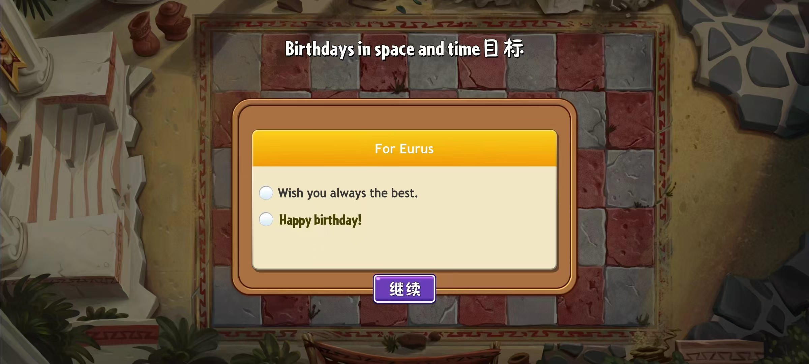

# E.7 曾以为再也不见

六月的国学挑战赛是我难得和E再次联系上的时候。这项由L牵头邀请我们参加的活动，E终究还是请来了自己少年宫的老师作为嘉宾评委。此后似乎有另一个社团工作需要在暑期完成，E似乎自己接了下来，写了两份稿子完成了。之后，E便再无音讯。我也觉得，她或许是不想再管了吧。作为一个卸任交接下一届的前社长，她是不需要继续关心什么了，可能。但不管怎么说，她是个核心社员。想起往几年那些个学长学姐们大三仍然积极活跃在乐团里，我总觉得她应该还会在之后的社团活动中出场，或许，我和她还能有那么一些联系吧。只是我的确不知道，她其实可以做到那么决绝。

暑假时，按照惯例各社团会开设第二课堂活动。以往线下正常的时候，我社的管理果冻是开设民族乐器教学班。但是这学期不能线下，那就只能进行线上讲座了。新任小社长本人是特别有自己想法的，很快出了一套民族音乐历史概要；而我自己也精心出了一讲现代民乐专题。然而，所有的线上活动参与者都相当寥寥，最后说是社团内部交流也不为过。我本来觉得E多少会支持一下社内活动，然而直到最后我亲自主讲的那一集她也没有上线。心头一阵无名业火骤起，我总觉得是她抛下了社团活动，更是抛下了我。我其实并不算理解这中间究竟发生了什么。就因为工作关系暂时结束了，她卸任交接了，就彻底把我抛在一边不闻不问了吗？也许，我的内心再一次燃起了如同一年多前的那种失望与愤怒。我恨她。所以，我想既然她不想再参与社团事务，而我并没有离开，我也不想再拉她做任何事情了。如果你想离开，我不会挽留，并且以后也不要再回来了。

于是很快，小社长联系我安排新学期的工作计划。我当时觉得去年年底就该办的音乐会到了现在一定得要尽快办上，毕竟等我们这届主力离开之后，新的音乐会就几乎不可能再继续了。小社长询问了E，得到的答复是按照之前的惯例把音乐会继续推到年末 。但我仍然觉得这个情况只适合速战速决——没有人知道下一次封控会发生在什么时候。我自作主张修改了音乐会的时间和方案，打算提到学期开始，随后通知小社长新学期的事务主要由我们仍然留下来的人完成，不必事无巨细告知前任社长。然后，或许是上层习惯性地找E这个上一任社长对接事情，我的修改最终被她知道了。

几乎是同时，E就发给了小社长一段语气极端不容质疑的话。大意是，她会直接按照之前的方案提交给上级，并且要我绝对服从，不能自作主张。小社长从未见识过这个场面，向我求助。我只觉得这件事情既然只是源于我和她的纠葛，不想波及无辜的新任。安抚了小社长的情绪，我决定第二天亲自去问E，她到底是怎么想的。为了更加完整地表达自己的想法，我甚至专门写了一份辩论草稿，罗列我提出的想法的理由。等到我自己完全搞清楚我要说什么了，我才终于下了决心找她掰扯清楚。

彼时已近9月。很久没有联系她的我，终于再次在私信里敲上字了。可是没等我说叨几句，想要指责她为什么暑假期间对社团事务不闻不问，她一连串暴风骤雨的语音输出就让我一瞬间懵了。她怒气冲冲地指责我擅改她的方案，指出自己“已经完成了三件事中的两件（国学挑战赛请老师与另一件写稿），把第二课堂放下来怎么了”。我还打算继续辩驳，随后她又发了一大串语音，意思是我眼里只有以N为首的一群社团成员，只有他们才是这个社团的核心力量，而她从头到尾都是无关紧要的。末了几句，“我觉得你从头到尾都没把握当个人看”，“既然你曾经说我是牛鬼蛇神之一，我也祝你们这群牛鬼蛇神能够成功”，“如果你想做社长，就和小社长自己联系调换去，我没问题”，和最后的，“以后，不要再联系了”。

那天我是在宿舍楼的楼道里听完那一句句几乎气急败坏的咒骂的。我的心情几乎是如坠冰窟。这还是两个月前和我说着，觉得我是她特好朋友之一的她吗。这还是之前那个和自己度过那么久友好沟通交流时间的她吗。为什么，发生什么了呢。以及，为什么我在她眼里，也变成了这样的评价呢。我第一次觉得，好难过啊。只是我终于知道一切已经不能挽回了，我再也回不到那个曾经和她近在咫尺的时候了。我仍然必须强迫自己继续走下去。一切的一切，真是太痛了吧。

只是，我以为E就会直接把我删掉。可是她除了把自己的状态签名更新成了两句“喜欢看一些无能狂怒，理屈词穷真的很好笑”之外并没有对我做任何的进一步措施。没有删好友，也没有设置朋友圈屏蔽。但是我只是觉得，她可能是不会在意我了。而一个月后，她在朋友圈官宣和一个同一所高中的学弟走到了一起，并且换上了情侣头像。绝望之下，我单方面删除了她的联系方式。

新学期的排练仍然不顺利。由于刚开学就因学校发现感染者而进入封控状态，我的开学演出计划也只能告吹。就连我自己都被拉到外面酒店隔离了一周，这学期开始的日子又是堪称一场浩劫。过了一个多月，学校逐步恢复日常秩序，我们才又有了线下排练的权利。只是，彼时的社团早已元气大伤，经历了这么久的线下禁止活动，同学们的积极性必然是受到打击的。社团招了一部分新人，我也需要让他们的水平跟上到能够上台排练的程度。尽管如此，这学期的排练仍然无限艰难。只是E既然已经不再希望联系，据小社长说她只心心念念她的宣传组——一切的压力几乎也只有我一个人来承担。然而，最后的希望还是破灭了。12月终于传来全面解封的好消息，然而随之而来的便是高校疏散学生，我们的音乐会再次被迫推迟。经历了种种，我自己可能也失去了斗志。眼看他高楼起，眼看他楼塌了。明年，还能有音乐会吗。亦或者，还会有这个社团吗。

在几乎绝望的心境里，我终于想到了那位似乎有着远见卓识的前任社长。和她合作的一年，即便是有再大的困难，我都没有那么绝望过。E能够独自一人摆平那么多事，我只需要负责好整个乐团的排练就可以了，我原来那时候是真的可以那么轻松。这样的时光，终究是回不去了。而她再怎么样，的确说到了一些社团中确实发生的问题。我又有了些想和她联系上的愿望，只是是自己主动删的她，之前又那样大吵过一架，现在她是否会搭理我还是未知中的未知。于是，我终于是颤抖着双手重新点开了她的个人名片，点击了添加好友。

没有跳出任何验证消息，直接就通过了。这也就意味着，我当时的删除是单向的，她没有清掉我这个联系人。我还是写了几句，大意是表达了对她的理解，觉得她有很多事情的处理以及表达的很多观点还是对的。出乎我意料的是，她也回复我了。她说自己曾经来看过一次这学期的排练，只是没有碰到我；感觉自她走后乐团凝聚力直线下降，排练太过松散了。我仍然对这一点表达了驳斥，因为在大环境影响下，我觉得这批同学能够坚持排练已经很不容易了。总之，这学期的排练并不是这一期故事的核心主题，暂且略过。只是E的评价是到这个时候还是只在拉踩，也就随我去了。

苦尽甘来之后，到了新年的春天，一切秩序终于恢复了正常，可我们这一届中坚力量却也大三下学期了。早先就有很多同学向我提出过希望能够离任交给新同学，但我知道离开他们那这支乐团就直接散了。由于非常深层的原因——同样会放在另一个专栏里介绍——乐团其实已经难以为继了，但我仍然希望自己能够为自己这两年的坚守交出一份答卷。我清楚地知道，如果再步尽快办音乐会，那就再也办不了了。在我的一手策划下，音乐会就放在了开学的第二周周末，我希望所有追随者们再坚持两周。我觉得作为恢复性质，这就足够了。我希望音乐会能够圆满，于是询问了E是否愿意前来，我愿意支付数额不低的一笔报酬。她同意了，并且说为了社团做事，不需要搞这些钱的事情。不久后是她这年的生日，我再次发去了生日祝福，说了很多好话，期望能够和解。而 她最终还是原谅了我曾经的鲁莽，重新回归做了些事情，参与了彩排，主持了候场工作，并最终促成了那场最后的演出。

然而那个时候，她已经和新男友在一起超过百天了，我也和N最终走到了一起——N篇的主要内容之一。各自置身于新的亲密关系当中，我显然不太能和她再有什么更多的接触了。在那中间我曾托她帮过两次忙，但之后便不再有什么后续了。我会偷偷关注她的朋友圈，但她显然不会对我发的东西有什么反应。某次偶然刷到她和闺蜜们去了一家所谓的失恋博物馆，才想起她似乎好久没有更新过和男友的动态了。后来，那些标志着他们美好回忆的朋友圈也不再对外可见。想来，也只有那唯一的一种可能了。

我和N最终没能走下去。但此时，和E也很难产生什么新的交集。本就想就此别过，从此沧海路人。对她的印象也只留下了她作为某华姓歌手的热衷粉几乎一场不落地看了每一场的巡回演唱会，以及那个暑假和她闺蜜们的外出旅行。只是没想到，年底的时候她用只有社团里会称呼我的口吻给我发了生日祝福。此前，已经有好几个月没有联系过了。我一瞬间感到十分意外，可是我没有找到什么更好的话题继续下去。我仍然是等到了第二年，也就是我本科的最后一个学期——精心制作了一张图片，给她发去了生日祝福，而又只是得到了一些不温不火的回应。

只是，这张图也是我用一款植物大战僵尸的改版的截图做的，由于没有找到适配的字体导致PS痕迹极其严重。E终于从Quarter换成了新的id叫作Eurus，想来终于还是回到了E吧。

转眼，到了最后一个学期。由于N从中作梗，作为社团元老的我无缘社团毕业生代表参演的校级毕业晚会。而我又想到了E，以此为契机再次联系了她。她终于告诉我说，其实她对这个社团并没有什么特别的感情。虽然她收到了邀请，但她已经入职了银行的管培项目，并且演出那几天会出差，因此就不去了。她说着让我不要灰心，毕竟什么事情都只是那么回事而已，过了若干年回过去看，一切都只是路人。我们彼此，也交换了各自的去向。我说着想约她吃饭，她没有拒绝，却因为后来各自都有很多这样那样的事情，而最后拖延到了暑假的八月份。算到那天，我已经一年多没见过她了。

