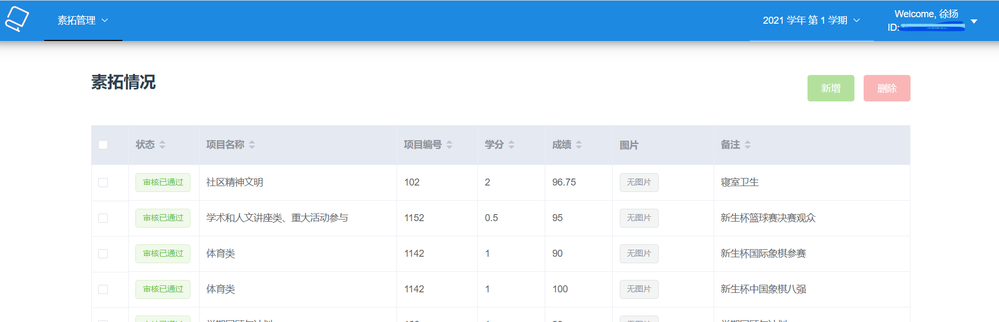

# G.1 我拿过校智运会前八？

虽然这个专栏主要打算写自己大四以后加入学校棋牌组织的经历，不过作为这一话题的起点，还是值得写一写自己前三年里和下棋有关的故事。

我算半个棋类爱好者，小时候自娱自乐接触过许多棋类。虽然永远学不明白围棋，倒是在中国象棋和国际象棋上取得了一些成果。但是，自己从未认真研究过这两类棋种的开局，很多时候自己只是在随开随走，因此并不能说自己有多少深入的水平。一般地，我只是努力将子力走成自己最适合的布局，然后抓住对手阵型的弱点进行进攻。自然地，这种下法会被针对性的对手杀穿，但这样我居然也能在当时的一款国际象棋联机软件中下到一个一级棋士的分段，也在天天象棋中下到了业6。自然地这些并不反映高水平，而且自己缺乏系统学习和训练，也没有继续深入钻研下去。即便如此，新入学的时候我还是报名参加了新生杯的中象与国象比赛。本来没打算有什么名次上的建树，可很有意思的是在中象比赛前几轮交手过了不同的对手，被杀穿一轮之后，在最后一轮大家都在以和为贵尽快完赛的时候我抓住了对手漏洞，拿下了最后一局，最终在近30名参赛选手中跻身前八，拿到了名次奖励。而自己的国象终究是退步神速，到参赛时几乎是一个完全荒废的状态，虽然第一局走出妙手困住对手，却也屡出败招，最终落败。

现在比较容易找到的，也就是来自学校综合测评网站的素质拓展记录了（笑）

虽然这类比赛的大多数用途是社团招新，但考虑到自己的中心更多在一月那边，我最终没有加入相应的社团。每次学校大型学生活动，即各大社团与学生组织在学校露天场地出摊展示的时候，我也往往驻守自己所在的社团摊位。身边并没有多少会下棋的朋友，因此也基本没怎么去那些社团的摊位逛过。

后来的一次交集是2022年大二下的疫情学期；在那个缺乏正常校园生活的时期，了解到了校方又举办了以棋类为核心的智力运动会，我再一次尝试了参与象棋项目——依然是那个半吊子水平的我。比赛是线上开摄像头形式，只是这次碰到了业9的高手，虽然中途成功将他牵扯进了僵局，却也在急于收割战果的途中走错一步，反被偷杀。总之，这次比赛参赛人数也不算多，最终也是落败。

出于同样的理由，我还是没有在那时加入组织，因此自己本科期间参与棋类运动的故事也算到此结束了。不过我那时也没有想到，另一个自己尘封许久的爱好——牌类，却帮助我在一年后走出低谷，认识了一群全新的优秀的朋友，让我提升了水平，再一次发现原来有个兴趣爱好还是这样有用的。
