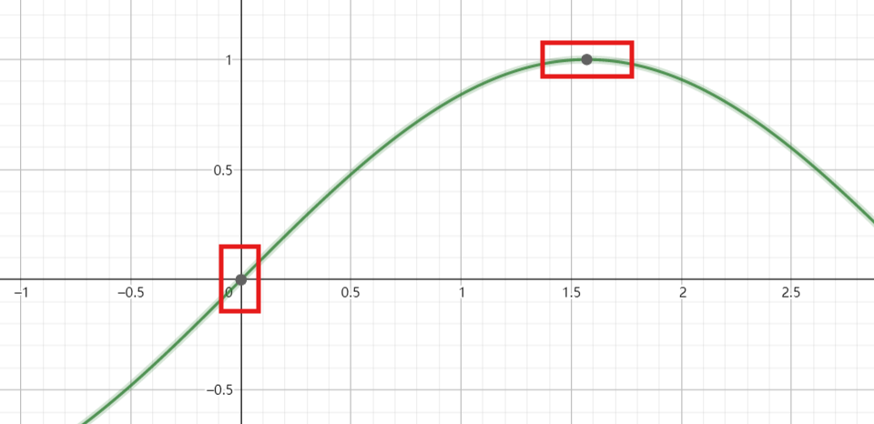
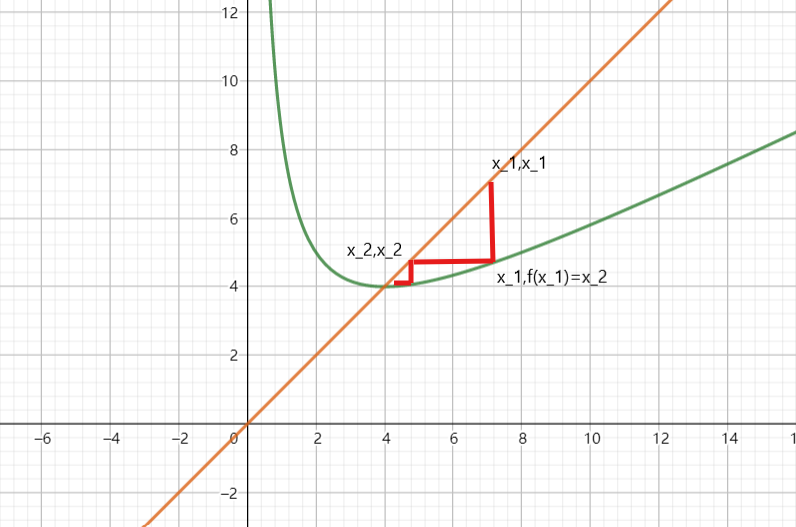

# M.1 数学随笔（1）极限与连续性证明

*如果 $ a>b $ ，则存在 $ c $ ，使得 $ a>c>b $ 。证明：取 $ c=\frac12(a+b) $ 即可。*

这是一条非常显然的定理，因为我们知道实数是稠密的。但其实单这条，就有助于对极限和连续的理解了。

回顾极限的定义：以函数趋于一点的极限为例， $ \forall \epsilon>0, \exists\delta > 0,\forall x:0<|x-x_0|<\delta, |f(x)-A|<\epsilon $ ，则记 $ \lim\limits_{x\rightarrow x_0}f(x)=A $ 。特别的，若 $ A=f(x_0) $ ，则 $ f(x) $ 在 $ x_0 $ 处连续。

那极限本质上是在说一件什么事情呢？也就是说，在 $ x\rightarrow x_0 $ 的过程中， $ f(x) $ 离A的距离被限制得不会太远。如果我们在连续函数上任取两个函数值不相等的点，那我们总有办法用一根分界线分开这两个点及其相关邻域。不过在此之前，我们先回顾一下一条看起来十分显然的命题：

例1.0. 给定正数 $ M>0 $ ，证明： $ \lim\limits_{x\rightarrow x_0}f(x)=A $ 与 $ \forall \epsilon>0, \exists\delta > 0,\forall x:0<|x-x_0|<\delta, |f(x)-A|<M\epsilon $ 等价。

分析：考虑“两步存在”构建命题桥梁。这里很多人会想描述成“因为 $ \epsilon $ 是任意的，所以 $ M\epsilon $ 是任意的”之类的表述，但这种表述在数学上是不规范的。本随笔专栏的一大目标也是将这种很直观但说不清楚的事情用严谨的数学语言表述。

证明：充分性。 $ \forall\epsilon>0,\exists\epsilon_1=M\epsilon $ ，*对这个 $ \epsilon_1>0 $ ，* $ \exists\delta>0,\forall x:0<|x-x_0|<\delta, |f(x)-A|<\epsilon_1=M\epsilon $ 。

必要性。 $ \forall\epsilon>0,\exists\epsilon_2=\frac\epsilon M $ ，对这个 $ \epsilon_2>0，\exists\delta>0,\forall x:0<|x-x_0|<\delta, |f(x)-A|<M\epsilon_2=\epsilon $ ，于是 $ \lim\limits_{x\rightarrow x_0}f(x)=A $ 。

这样就把说不清楚的任意性的问题绕开了。

例1.1. 证明：连续周期函数若不是常值函数，则一定存在一个最小正周期。

本题是数学分析课上老师留的思考题，当时我自己想出了一种做法。后来查询网络，在两年后网络发布的一则视频里看到了一个类似的证明思路。要点仍然是连续性的定义以及其带来的如上性质。

实际上，我们需要想象在这个连续过程里发生了什么。即如果这个周期任意小，对于一个连续函数而言会发生什么。考虑下图：

由于标称的两个点受到矩形的限制，其函数值的变化局限在了两个完全不相同的值附近。如果这时还要求一个太小的周期，显然左框挪动的步长太小，挪到右边一定会发生函数值不相等的矛盾。

基于以上思考，结合实数基本定理，我们可以写出如下的证明：

证明：考虑周期函数 $ f(x) $ 的正周期集合 $ S=\{T|T>0,f(x+T)-f(x)\equiv0\} $ 。

首先说明: $ \exists\delta>0 $ ，使得 $ \forall t\in (0,\delta),t\notin S $ 。

考虑 $ f(x) $ 上两点 $ (x_1,f(x_1)),(x_2,f(x_2)) $ ，满足 $ x_1\neq x_2 $ ， $ f(x_1)\neq f(x_2) $ 。不妨 $ x_1<x_2 $ 且 $ f(x_1)<f(x_2) $ ，因为若此时 $ f(x_1)>f(x_2) $ ，任意取一个 $ T_0\in S $ ，根据取整不等式 $ [x]\le x<[x]+1 $ 有 $ x_1'=x_1+([\frac{x_2-x_1}{T_0}]+1)T_0>x_2 $ 且 $ f(x_1')=f(x_1)>f(x_2) $ ，取 $ x_2,x_1' $ 为新的 $ x_1,x_2 $ 代入证明即可。

考虑 $ \epsilon=\frac{f(x_2)-f(x_1)}{2}>0 $ ，记 $ M=\frac{f(x_2)+f(x_1)}{2} $ 则 $ \exists\delta>0,\forall x\in(x_2-\delta,x_2+\delta),f(x)>f(x_2)-\epsilon=M $ 。

若 $ \exists \delta_0<\delta,\delta_0\in S $ ，考虑 $ x_1'=x_1+[\frac{x_2-x_1}{\delta_0}]{\delta_0} $ ，由 $ x-1<[x]\le x $ 可知 $ x_2-\delta<x_2-\delta_0<x_1'\le x_2 $ ，于是 $ f(x_1)=f(x_1')>M $ ，矛盾。

因此 $ \delta>0 $ 是 $ S $ 的一个正下界。由确界原理，可知 $ S $ 有下确界 $ \inf S\ge \delta>0 $ 。下证 $ \inf S\in S $ 。

事实上，根据下确界的定义，若 $ \inf S\notin S $ ，则对上述 $ \delta>0 $ ， $ \exists t_1\in(\inf S,\inf S+\delta),t_1\in S; \exists t_2\in(\inf S,t_1), t_2\in S $ 。于是 $ 0<t_1-t_2<\delta $ ，又 $ \forall x,f(x)=f(x+t_1)=f(x+t_1-t_2) $ 得 $ t_1-t_2\in S $ ，从而矛盾。

因此 $ \inf S\in S $ 是所求的最小正周期。

如果能用图像画出一个问题想要探究什么，数学证明便只需要将文字转化为数学语言描述即可。再举一个竞赛题改编的题目：

例1.2 （第十三届全国大学生数学竞赛非数学类初赛T2改）已知数列 $ \{x_n\} $ 满足 $ x_1=8, x_n^2-2(x_n+1)x_{n+1}+15=0 $ ，求证 $ \{x_n\} $ 极限存在并求极限。

首先考虑这个东西到底是什么。 $ x_{n+1}=\frac{x_n^2+15}{2(x_n+1)} $ 看上去像是个二次除以一次的式子，似乎暗含一个对勾函数。配个方， $ x_{n+1}=\frac{(x_n+1)^2+14-2x_n}{2(x_n+1)}=\frac{x_n+1}2-1+\frac{8}{x_n+1} $ ，于是 $ \{x_n+1\} $ 满足简单函数递推关系，即 $ f(x)=\frac x2+\frac 8x,y_n=x_n+1,y_{n+1}=f(y_n) $ 。考虑对勾函数与 $ y=x $ 的图像（图中将 $ y $ 标成了 $ x $ ）：

如上作图迭代，可以观察到 $ y_n $ 收敛到了函数的不动点（与 $ y=x $ 的交点）。从图像形态我们可以猜测两点： $ y_n>4 $ ，且单调递减，从而向这个方向去发展了。

证明：

 $ y_n $ 推导略。下证 $ y_n>4 $ 且 $ y_n $ 单调递减：

1.  $ y_1>4 $ 。对 $ y_k>4 $ ，有 $ y_{k+1}=\frac {y_k}2+\frac8{y_k}\ge4 $ ，又等号当且仅当 $ y_k=4 $ 取到，于是 $ y_{k+1}>4 $ 。

2. 考虑 $ y_{n+1}-y_n=\frac 8{y_n}-\frac{y_n}2 $ ，当 $ y_n>4 $ 时 $ \frac 8{y_n}<\frac{y_n}2 $ 恒成立，于是 $ y_{n+1}<y_n $ 。

根据单调有界定理， $ \{y_n\} $ 存在极限。对递推式两边取极限舍去负根可得 $ \lim\limits_{n\rightarrow\infty}y_n=4 $ ，因此所求极限为 $ 3 $ 。

本期专栏暂时分享如上几点。
