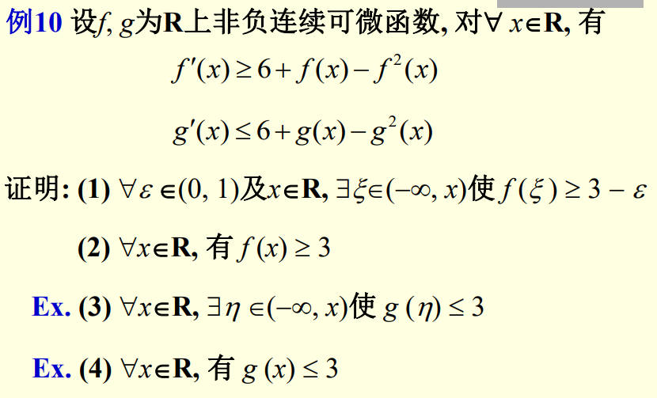

# M.3 数学随笔（3）微分中值定理与微分方程证明

一般而言这是两个话题，但由于单值存在性微分中值定理的证明其实内含了微分方程的技巧，因此出在一讲里。

**例3.1** 已知函数$f(x)$在$[a,b]$上连续，在$(a,b)$内可导，$f(a)=f(b)=0$，试证明：

（1）当$a>0$时，$\exists \xi\in(a,b),f'(\xi)=\frac{f(\xi)}\xi$

（2）$\forall \lambda\in \R,\exists\xi\in(a,b),f'(\xi)=\lambda f(\xi)$

分析：此类问题的破局关键在于构造相应的满足微分中值定理的辅助函数$g$，在$[a,b]$上满足中值定理适用条件且$g'$应当与待证式具有类似的形式。对于(1)，考虑到$f'(\xi)-\frac{f(\xi)}\xi=\frac{\xi f'(\xi)-f(\xi)}\xi$，可取$g_1(x)=\frac{f(x)}x$；对于(2)，反解微分方程$f'(\xi)-\lambda f(\xi)=0$可以得到$\ln |f(\xi)|=\lambda \xi+C_1\implies f(\xi)=C\mathrm e^{\lambda \xi}\implies f(\xi)\mathrm e^{-\lambda \xi}=C$（$C$为任意常数），取$g_2(x)=f(x)\mathrm e^{-\lambda x}$

证明：（1）构造辅助函数$g_1(x)=\frac{f(x)}x$满足在$[a,b]$上连续，$(a,b)$内可导，$g_1(a)=g_1(b)=0$，根据Rolle中值定理，$\exists\xi\in(a,b)$且$\xi>0$，$0=g_1'(\xi)=\frac{\xi f'(\xi)-f(\xi)}{\xi^2}$，化简即证。

（2）构造辅助函数$g_2(x)=f(x)\mathrm e^{-\lambda x}$满足在$[a,b]$上连续，$(a,b)$内可导，$g_2(a)=g_2(b)=0$，根据Rolle中值定理，$\exists\xi\in(a,b)，0=g_2'(\xi)=\mathrm e^{-\lambda x}[f'(\xi)-\lambda f(\xi)]$，化简即证。

**例3.2** 已知$f(x)$在$[0,1]$上连续，证明$\exists \xi\in(0,1), \int_\xi^1 f(x)\mathrm dx=\xi f(\xi)$。

分析：如将左端视为函数$F(x)$，则$f(x)=-F'(x)$。考虑$F(x)+xF'(x)=[xF(x)]'$，可构造函数$g(x)=xF(x)$。

证明：构造辅助函数$g(x)=x\int_x^1 f(t)\mathrm dt$，则$g(x)$在$[0,1]$上连续，在$(0,1)$内可导，$g(0)=g(1)=0$。由Rolle中值定理，$\exists \xi\in (0,1), 0=g'(\xi)=\int_\xi^1 f(t)\mathrm dt-\xi f(\xi)$，移项得证。

**例3.3** 设$f(x)$在$[a,b]$上二阶可导，$f'(a)=f'(b)=0$，试证明$\exists \xi\in (a,b)$，$|f''(\xi)|\ge\frac 4{(b-a)^2}|f(b)-f(a)|$。

分析：本题是经典的Taylor近似证明题。注意到待证式中有区间折半平方，因此考虑区间中点在区间端点处的Taylor展开。

证明：令$\frac {a+b}2=x_0$。将$f(x_0)$在$a,b$处分别进行Taylor展开，可得

$$
\left\{\begin{aligned}
f(x_0)&=f(a)+f'(a)(x_0-a)+\frac {f''(\xi_1)}2(x_0-a)^2, &\xi_1\in (a,x_0) \\
f(x_0)&=f(b)+f'(b)(x_0-b)+\frac {f''(\xi_2)}2(x_0-b)^2, & \xi_2 \in (x_0,b)
\end{aligned}
\right.
$$

两式相减，代入$f'(a)=f'(b)=0$可得$f(b)-f(a)+\frac {(b-a)^2}4[\frac {f''(\xi_2)}2-\frac {f''(\xi_1)}2]=0$，移项取绝对值即有$\frac 4{(b-a)^2}|f(b)-f(a)|=|\frac {f''(\xi_2)}2-\frac {f''(\xi_1)}2|$。

记$\xi=\argmax\{|f''(\xi_1)|,|f''(\xi_2)|\}$，则$|\frac {f''(\xi_2)}2-\frac {f''(\xi_1)}2|\le|\frac {f''(\xi_2)}2|+|\frac {f''(\xi_1)}2|\le|f''(\xi)|$,得证。

**例3.4** 设$f(x)$在 $[0,+\infty)$上有界连续，试证明微分方程$y''+14y'+13y=f(x)$的每个解在$[0,+\infty)$上均有界。

本题是第十三届全国大学生数学竞赛非数学类初赛原题。目前社会上仅流通一份通过求出微分方程解进行证明的解答，可能是评分标准，但私以为比较繁琐。这里给出我在考场上写出的解答，自己认为是严格的。如有不妥，欢迎商榷。

分析：容易看出原微分方程的通解是$C_1\mathrm e^{-x}+C_2\mathrm e^{-13x}$，也就是说通解项显然在$[0,+\infty)$上有界，但还需要解出特解，形式繁琐。不妨直接考虑，倘若这个方程是一阶的，其应当具有某种$g'+\lambda g=f,\lambda>0$的形式。倘若能证明这个更强的结论，即$g$在$[0,+\infty)$是有界的，那本题也能够自然得证。

证明：首先考虑方程$g'(x)+\lambda g(x)=f(x)$，其中$\lambda>0$。考虑$x>0$，此式等价于$[\mathrm e^{\lambda x}g(x)]'=f(x)\mathrm e^{\lambda x}$，可得$g(x)=\mathrm e^{-\lambda x}[\int_0^x f(t)\mathrm e^{\lambda t}\mathrm dt+C]$，式中$C$是一个任意常数。

现在考虑两边的界。设$|f(x)|\le M, x \ge0,$

$$
\begin{aligned}
|g(x)|&=\left|\mathrm e^{-\lambda x}\left[\int_0^x 
f(t)\mathrm e^{\lambda t}\mathrm dt+C\right]\right| \\
&=\mathrm e^{-\lambda x}\left|\int_0^x 
f(t)\mathrm e^{\lambda t}\mathrm dt+C\right| \\
&\le \mathrm e^{-\lambda x}\left[\left|\int_0^x 
f(t)\mathrm e^{\lambda t}\mathrm dt\right|+|C|\right] \\
&\le \mathrm e^{-\lambda x}\left[\int_0^x 
|f(t)|\mathrm e^{\lambda t}\mathrm dt+|C|\right] \\
&\le \mathrm e^{-\lambda x}\left(\int_0^x 
M\mathrm e^{\lambda t}\mathrm dt+|C|\right) \\
& = \mathrm e^{-\lambda x}\left[\frac M\lambda (e^{\lambda x}-1)
+|C|\right] \\
&<\frac M\lambda+|C|
\end{aligned}
$$

所以$g(x)$在$[0,+\infty)$上有界。

令$h(x)=y'+13y$，则$h'+h=f$，于是$h$有界，从而$y$也有界。证毕。

注：这一不等式的思想在原解答中也有体现，只是原解答解了二阶微分方程，从给出解答中看似乎没有这个必要。

**例3.5** 直接引用上海交通大学陈克应老师《数学分析与高等代数选讲》课件，并且相当感谢，侵权删除：

本题在课堂上对前两问老师给出了解答，但课后的三四问自己遇到了困难。最终自己决定从微分方程的角度进行求解。

分析：首先考虑$u'=6+u-u^2=(2+u)(3-u)\implies\frac {u'}{2+u}+\frac {u'}{3-u}=5$，

两边积分得$\ln\left|\frac {2+u}{3-u}\right|=5x+C_1\implies\left|\frac {u-3}{u+2}\right|\mathrm e^{5x}=C$，构造函数$h(x)=\mathrm e^{5x}\frac{u-3}{u+2}$，式中$u\in\{f(x),g(x)\}$，则$h'(x)=\frac{5\mathrm e^{5x}}{(u+2)^2}[u'+(u-3)(u+2)]$。

证明：如上构造函数$h$。当$u=f(x)$时，$h'\ge0$，（非严格）单调递增；当$u=g(x)$时，$h'\le0$，单调递减。特别的，因为$u\ge 0$，于是$\lim\limits_{x\rightarrow-\infty}h(x)=0$。

现在考虑(2)和(4)。若$\exist x_0,f(x_0)<3$，则$h(x_0)<0$。前面已经说过此时$h$是单调递增的，于是引发矛盾。类似地，若$\exists x_0,g(x_0)>3$，同样有$h(x_0)>0$，与$h$单调递减矛盾，因此得证。

注：以下对第一个命题进行严格书写：已知$\lim\limits_{x\rightarrow-\infty}f(x)=0$且$f(x)$单调递增，试证明$f(x)\ge0$。
证明：假设$\exists x_0,f(x_0)<0$。则$\forall x<x_0,f(x)\le f(x_0)< \frac{f(x_0)}2< 0$。令$\epsilon=-\frac{f(x_0)}2>0$，有$\forall \delta\in \R, \exists x=\min\{\delta,x_0\}-1,|f(x)|>\epsilon$，因此矛盾。

直观上可以理解为，无穷远处函数值为零且单调递增，函数显然不可能穿过数轴变成负数。