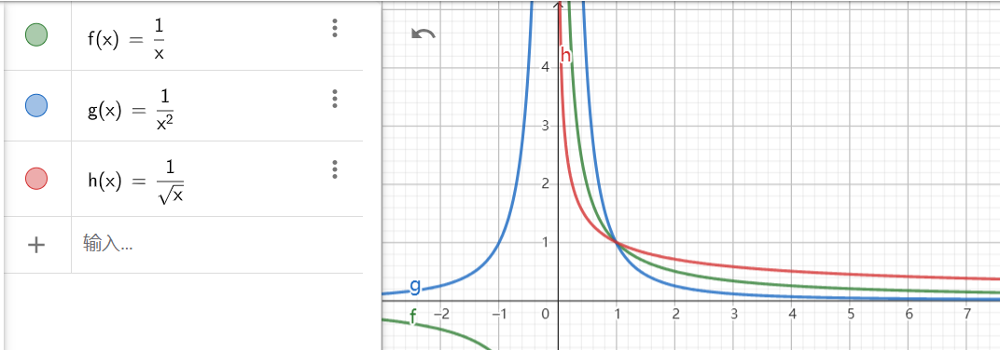

# M.5 数学随笔（5）收敛性判别

广义积分（或称反常积分）与级数分析一直是高等数学中最难的一部分话题，且一般课程对此的要求并不高。尽管如此，还是将其中一些比较有特色的问题拿出来和大家一同探讨。

**例5.1** 已知正项级数$\{a_n\}$的部分和$\sum\limits_{k=1}^n a_n$收敛，证明当$q>\frac 12$时$\sum\limits_{n=1}^\infty \frac {\sqrt{a_n}}{n^q}$存在。

本题是我第一学期数学分析课程期末考试的原题，且老师甚至在课上讲过如何处理。然而我临场没有想起来，于是遗憾与高分失之交臂。之后这一方法被我刻骨铭心地记下。有趣的是，在Fourier级数分析问题里也用到了类似的方法。

证明：利用基本不等式$ab\le\frac 12(a^2+b^2)$，可得$\frac {\sqrt{a_n}}{n^q}\le\frac 12(a_n+\frac 1{n^{2q}})$，当$q>\frac 12$时$\sum\limits_{n=1}^\infty \frac 1{n^{2q}}$存在，于是正项级数$\{\frac {\sqrt{a_n}}{n^q}\}$的部分和有上界，因此部分和收敛。证毕。

**例5.2** 证明：考虑函数$f_0(x)=\sin\frac1x,x\in[-\pi,\pi] \backslash \{0\}$并补充定义$f_0(0)=0$，将其$2\pi$周期延拓展开为三角形式的Fourier级数，其各阶Fourier系数存在。

本题来源于信号与系统课程中关于Fourier级数的讨论延申。由于Fourier级数的Dirichlet条件过于严格，而$\sin \frac 1x$不满足其有限区间上有限个严格极值点的条件。本分析摘录自自己之前提交的讨论内容，同时综合运用了广义积分的敛散判别法，供大家参考。

证明：注意到其三角形式的Fourier系数$a_n=\frac 1\pi\int_{-\pi}^\pi  \sin\frac 1x\cos nx\mathrm dx=\frac 1\pi\int_{-\pi}^0  \sin\frac 1x\cos nx\mathrm dx+\frac 1\pi\int_{0}^\pi  \sin\frac 1x\cos nx\mathrm dx$，其中$0$为这一瑕积分的瑕点。为判断瑕积分敛散性，考察积分$\int_{0}^\pi  \sin\frac 1x\cos nx\mathrm dx\overset{u=\frac 1x}{=}\int_{\frac 1\pi}^{+\infty}  \frac {\sin u\cos \frac nu}{u^2}\mathrm du$​​​，

先考虑无穷积分$\int_{\frac 1\pi}^{+\infty}  \frac {\sin u}{u^2}\mathrm du$，由于$\frac 1{u^2}$在$[\frac 1\pi,+\infty)$上单调递减趋于零，而变上限积分$I(A)=\int_{\frac 1\pi}^A\sin u \mathrm du$满足$|I(A)|\le 2$有界，故根据Dirichlet判别法，这个积分收敛。又当$u>\frac{2n}\pi$时$\cos \frac nu$单调递增且有界，由Abel判别法即得$\int_{\frac 1\pi}^{+\infty}  \frac {\sin u\cos \frac nu}{u^2}\mathrm du$​对任意给出的$n$​收敛。

同理，可知$a_n$​​收敛；完全类似地证明$b_n=\frac 1\pi\int_{-\pi}^\pi  \sin\frac 1x\sin nx\mathrm dx$​​收敛，从而其Fourier系数存在。​

事实上，当$x\neq 0$时，总能找到一个充分小的邻域，保证$f(x)$在其上单调，从而满足D-J判别法，由连续性则$f(x)$的Fourier级数收敛到$f(x)$本身。注意到$f(x)$为奇函数，则$a_n\equiv0$，当$x=0$时，易得$f(0)$的Fourier级数退化为0。

注：$\sum\limits_{k=1}^n\cos kx=\frac 1{\sin \frac x2}\sum\limits_{k=1}^n\sin \frac x2\cos kx=\frac 1{2\sin\frac x2}\sum\limits_{k=1}^n[\sin(kx+\frac x2)-\sin(kx-\frac x2)]=\frac 1{2\sin\frac x2}(\sin \frac {2k+1}2x-\sin \frac x2)$

**例5.3**  讨论无穷积分的敛散性：$\int_1^{+\infty}\frac {(\ln x)^p}{1+x^2}\mathrm dx,\int_1^{+\infty}\frac{\sin x^2}{x^p}\mathrm dx, p>0$

分析：寻找函数的阶，根据已有的敛散结论，使用比值判别法进行证明。

首先考虑常用函数$\frac 1{x^q}$。当$q=1$，$\int_0^1\frac 1x\mathrm dx$与$\int_1^{+\infty}\frac 1x\mathrm dx$都是发散的，当$q>1$时$\int_0^1\frac 1{x^q}\mathrm dx$发散，$\int_1^{+\infty}\frac 1{x^q}\mathrm dx$则收敛，当$0< q< 1$时敛散性则相反。这个结论事实上可以用图像形象化记忆，如图绘出了$q=1,2,\frac 12$这三种情况。

当$q>1$时，可以认为是将$\frac 1x$绕$(1,1)$进行了朝着$x$轴的偏转，这样自然有$[1,+\infty)$上积分收敛，另一边发散。同样的，$q<1$时可认为是朝$y$轴的偏转。

之后考虑比值判别法。这个广义比值$l=\lim\limits_{x\rightarrow+\infty}\frac{f(x)}{g(x)}$事实上说明$x\rightarrow+\infty$时$f(x)\sim lg(x)$。因此若$l=0$而$\int_a^{+\infty}g(x)\mathrm dx$收敛，自然$f(x)$的阶比$g(x)$低，一定收敛。完全类似地，可以理解另一边。

解：（1）先考虑$\int_1^{+\infty}\frac {(\ln x)^p}{x^2}\mathrm dx$的敛散性。考虑辅助函数$h(x)=\frac 1{x^{\frac 32}}$，则$\frac{\frac {(\ln x)^p}{x^2}}{\frac 1{x^{\frac 32}}}=\frac {(\ln x)^p}{x^{\frac12}}$。当$x\rightarrow +\infty$时，L'Hospital一次有$\frac {p(\ln x)^{p-1}}{\frac 12x^{-\frac12}\cdot x}=\frac {2p(\ln x)^{p-1}}{x^{\frac12}}$，因为$p>0$是确定的，因此经历$[p]$次L'Hospital法则后可知原比值极限为 $0$。
无穷积分$\int_1^{+\infty}\frac 1{x^{\frac32}}\mathrm dx$收敛，根据比值判别法，可知$\int_1^{+\infty}\frac {(\ln x)^p}{x^2}\mathrm dx$收敛，所以$\int_1^{+\infty}\frac {(\ln x)^p}{1+x^2}\mathrm dx\le\int_1^{+\infty}\frac {(\ln x)^p}{x^2}\mathrm dx$（绝对）收敛。

（2）当$p>1$时，$\int_1^{+\infty}\left|\frac{\sin x^2}{x^p}\right |\mathrm dx\le \int_1^{+\infty}\frac1{x^p}\mathrm dx$收敛，原无穷积分绝对收敛。

当$p\le1$时，首先考虑原始积分。先考虑$\int_1^{+\infty}\sin x^2\mathrm dx\overset {u=x^2}=\int_1^{+\infty}\frac{\sin u}{2\sqrt u}\mathrm du$。因为$\frac 1{\sqrt u}$单调递减趋于零，而变上限积分$\int_1^A\sin u\mathrm du$有界，因此由Dirichlet判别法，这一无穷积分收敛。又因为$\frac 1{x^p}$是单调有界的，因此根据Abel判别法，原积分收敛。

下面考虑绝对收敛性。由于$|\sin t|\le 1$，有$|\sin x^2|\ge\sin^2x^2=\frac 12(1-\cos 2x^2)$。完全相似地可以证明$\int_1^{+\infty}\frac{\cos 2x^2}{x^p}\mathrm dx$收敛，但是$\int_1^{+\infty}\frac 1{x^p}\mathrm dx$发散，所以$\int_1^{+\infty}\left|\frac{\sin x^2}{x^p}\right |\mathrm dx\ge\frac 12[\int_1^{+\infty}\frac 1{x^p}\mathrm dx-\int_1^{+\infty}\frac{\cos 2x^2}{x^p}\mathrm dx]$发散。

综上，这一积分条件收敛。

注 $\int_0^{+\infty}\sin x^2\mathrm dx, \int_0^{+\infty}\cos x^2\mathrm dx$是所谓的Fresnel积分，可查[资料](https://en.wikipedia.org/wiki/Fresnel_integral)算得其收敛值为$\sqrt{\frac\pi8}$

**例5.4** 设$f(x)$在$[0,+\infty)$上一阶导函数连续，且$f(0)>0, f'(x)\ge 0$，证明：$\int_0^{+\infty} \frac 1{f(x)}\mathrm dx$与$\int_0^{+\infty} \frac 1{f(x)+f'(x)}\mathrm dx$同敛散。

分析：即证明收敛的充分必要性。本题的精髓在于如何处理分母上的$f'(x)$。

证明：由于$f'(x)\ge0$，因此$f(x)\ge f(0)=0$，必要性由$\frac  1{f(x)+f'(x)}\le\frac 1{f(x)}$即证。现在考虑充分性。

事实上，$\frac 1{f(x)}=\frac 1{f(x)+f'(x)}+\frac{f'(x)}{f(x)[f(x)+f'(x)]}$，而$\frac{f'(x)}{f(x)[f(x)+f'(x)]}\le\frac{f'(x)}{[f(x)]^2}=-\left[\frac {1}{f(x)}\right]'$，从而$\int_0^{+\infty}\frac{f'(x)}{f(x)[f(x)+f'(x)]}\mathrm dx\le-\int_0^{+\infty}\mathrm d\frac 1{f(x)}=\lim\limits_{x\rightarrow+\infty}\left[\frac 1{f(0)}-\frac 1{f(x)}\right]$。因为$f(x)$单调递增，所以函数$\frac 1{f(0)}-\frac 1{f(x)}$也单调递增，但永远以$\frac1{f(0)}$为上界，因此极限存在。（单调函数单侧极限定理）

因此，$\int_0^{+\infty} \frac 1{f(x)}\mathrm dx=\int_0^{+\infty}\frac 1{f(x)+f'(x)}\mathrm dx+\int_0^{+\infty}\frac{f'(x)}{f(x)[f(x)+f'(x)]}\mathrm dx$收敛，充分性得证。

**例5.5** 已知${a_n}=\int_0^{\frac \pi2}t\left|\frac {\sin nt}{\sin t}\right|^3\mathrm dt$，证明$\sum\limits_{n=1}^\infty\frac 1{a_n}$发散。

分析：本题又需要将积分分为两部分进行估计，考虑$\frac 1n$为分界点。

证明：由Jordan不等式$\frac 2\pi\le\frac{\sin t}t< 1, t\in (0,\frac\pi2]$，考虑两个区间$[0,\frac 1n],[\frac1n,\frac\pi2]$上的积分。

第一部分$\int_0^{\frac 1n}t\left|\frac {\sin nt}{\sin t}\right|^3\mathrm dt\le\int_0^{\frac 1n}tn^3\mathrm dt=\frac n2$，

第二部分由$\frac1{\sin t}\le\frac{\pi}{2t}$，可得$\int_{\frac 1n}^{\frac \pi2}t\left|\frac {\sin nt}{\sin t}\right|^3\mathrm dt\le\int_{\frac 1n}^{\frac \pi2}t\left(\frac \pi{2t}\right)^3\mathrm dt=\frac {\pi^3}8(n-\frac 2\pi)<8n$。

于是$a_n<9n$，可知$\frac 1{a_n}>\frac 1{9n}$，所以级数和发散。

级数理论问题难、杂，且本专栏暂时没有涉猎有关一致收敛性的内容，仅为较有心得的冰山一角，供各位商榷。