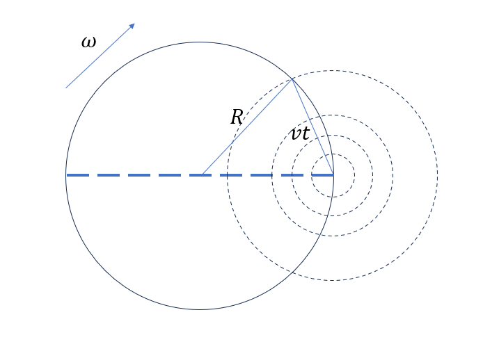

# M.Ex 杂题
**例Ex.1** 已知代数式$2p^2+p+9$中$p$为素数且其结果为完全平方数，求$p$。
本题是高中时一道习题的重要中间步骤，并且老师没有给出满意的解释。我自己花了一整天给出了一个解答，也因此成为了我高中期间的代表作。后来在N的合作参与下得到了另一个更为简单的解法。

解1 设$2p^2+p+9=N^2,N\in \N$。将等式左端配凑为$(2p+3)^2=4p^2+12p+9$，于是$(2p+3)^2=N^2+p(2p+11)$，化简得$(2p+3+N)(2p+3-N)=p(2p+11)$。

注意到等式两端必然要能被$p$整除，再考虑到$2p+3-N\ge0,p\ge2$，于是$N\in\{3,p\pm3,2p\pm 3,3p-3\}$。逐个解方程可得$p=5$是唯一素整数解。

解2（更为自然的解法）由设得$2p^2+p=(N+3)(N-3)$，设$N=mp\pm3, m\in\N$，得$2p+1=m(mp\pm 6)$，整理得$(m^2-2)p=\pm6m+1$，于是$p=\frac{\pm6m+1}{m^2-2}$。由于当$|m|>\frac {3+\sqrt {19}}2\implies |m| \ge 4$时$|p|<2$，仅需考察$|m|\le 3$的7个点，经逐个计算后可知$m=\mp1$时$p=5$是唯一解。

**例Ex.2** 考虑一个半径为$R$圆盘以$\omega$的角速度匀速转动，一个质点以自身速度大小为$v$在圆盘上运动，求其从圆盘一条直径的一端运动到此时另一端与水平面接触点的时间以及路径轨迹。

本题是自己在玩一款名叫《糖豆人》的游戏时提出的问题，后来作为大学物理课程讨论参与的题目贡献给了大家。不过有高人指出改变参考系之后，问题便迎刃而解了。

解：考虑圆盘不动，直径另一端点沿圆周向质点旋转。每过时间$t$，质点的最大运动范围扩展到以起点为圆心、$vt$为半径的圆，因此只需算得某一时间$t_0$时另一端点旋转到质点运动范围内即可。

考虑图中三角形的三边关系，由余弦定理可得$2R^2-2R^2\cos(\pi-\omega t)=v^2t^2$，于是$v^2t^2-2R^2\cos\omega t=2R^2$。这是关于$t$的超越方程，大部分情况没有闭式解。

由于质点的运动是匀速直线运动与圆周运动的叠加，曲线近似为一条旋轮线（但因为不是匀速圆周运动，因此不是严格的摆线）